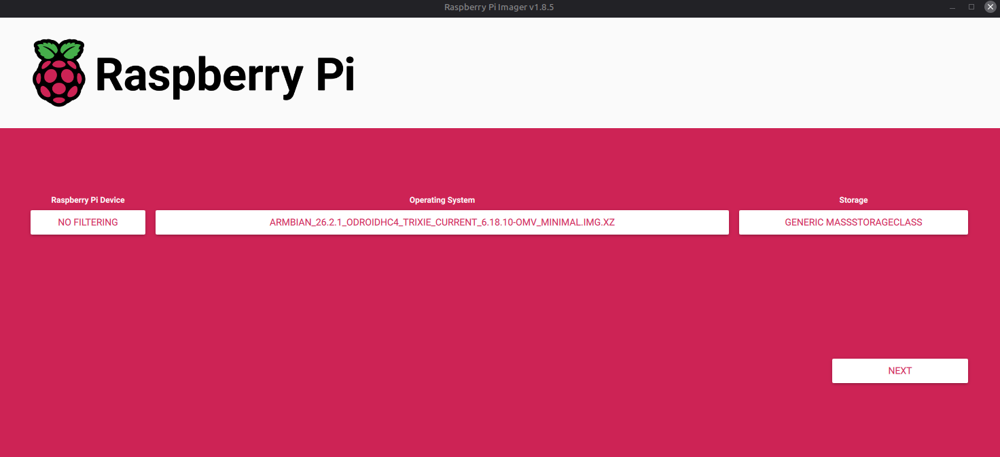
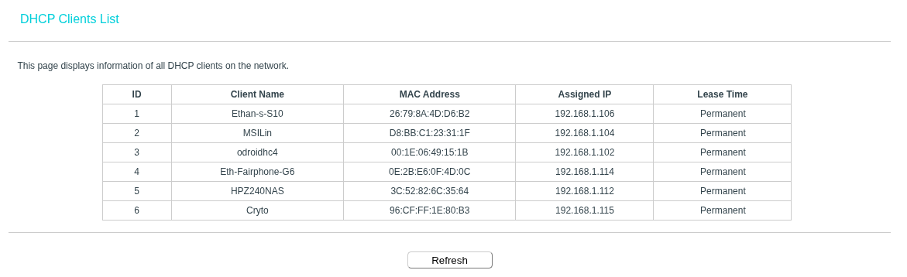
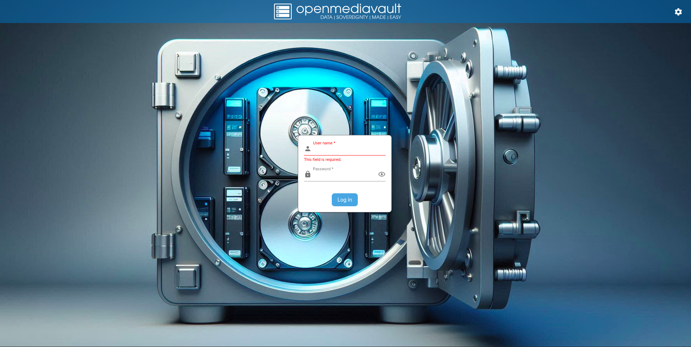
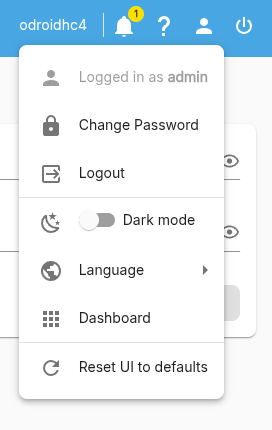
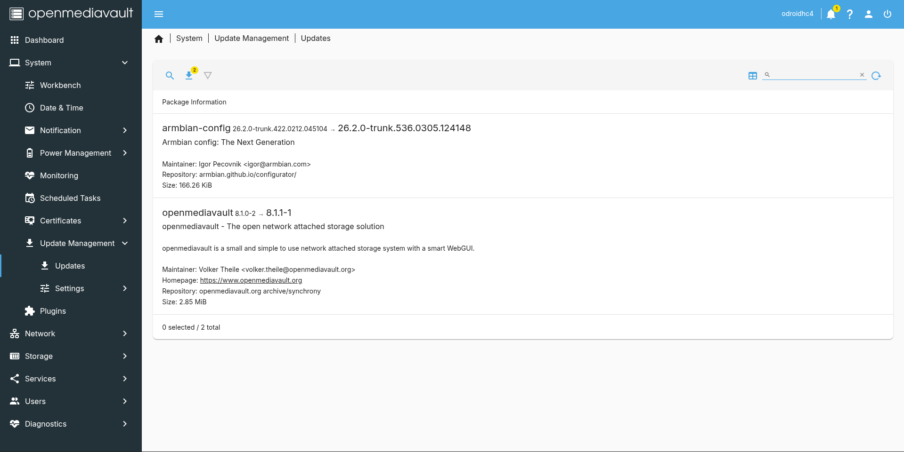
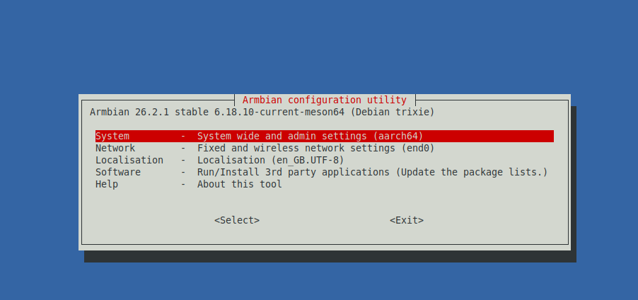
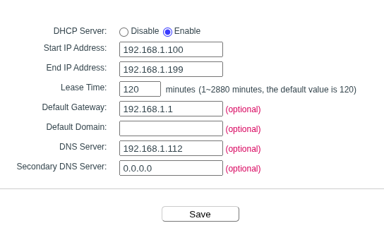

# Installing Open Media Vault

Date Written: 07/04/2026 TODO: Update

This guide outlines the process of installing Open Media Vault (OMV) on the Odroid HC4 specifically. It must be noted that at the time of writing. There are many ways to install OMV depending on platform (X86 PC, Raspberry Pi, etc). This guide will go over the specifics of installing OMV on the Odroid HC4. Please research the process for your appropriate platform. You can view my [NAS Setup guide](https://github.com/EthanSousaProjects/Personal_Server_Setup) which uses an X86 computer for installing OMV. Further details of this method and others can be found in the [OMV installation documentation page](https://docs.openmediavault.org/en/latest/installation/index.html).

## SD card Image flashing

To install OMV on this board, we need to flash the boot SSD and remove the default Petitboot loader. This loader is installed by default on this odroid board and we must remove it to allow the board to correctly boot. The [Armbian HC4 page](https://www.armbian.com/odroid-hc4/) describes how to remove the petitboot loader. It has been included here for completeness.

1) Connect a monitor and keyboard to the board and power it up.
2) Once booted up, in the Petitboot menu, go to `exit to shell`.
3) Once in the shell, run the following commands

```sh
flash_eraseall /dev/mtd0
flash_eraseall /dev/mtd1
flash_eraseall /dev/mtd2
flash_eraseall /dev/mtd3
```

Once completed, you are ready to install armbian to an SD card.

The easiest method to flashing the armbian image to the SD card is to use [Armbian Imager](https://github.com/armbian/imager). This is a flashing utility built for the armbian project making it easy to flash the correct board image to an SD card. I would recommend this method to users new to the process. I however, will install my image through [raspberry pi imager](https://www.raspberrypi.com/software/) downloading the correct image from the [Armbian HC4 page](https://www.armbian.com/odroid-hc4/) and verifying the file integrity and authenticity. An alternative to raspberry pi imager is [BalenaEtcher](https://etcher.balena.io/) which is commonly used. My [NAS OMV install guide](https://github.com/EthanSousaProjects/Personal_Server_Setup/blob/main/01_Installing_OMV.md) uses BalenaEtcher.

How to verify the file Integrity and authenticity in detail will not be mentioned in this repo. Please read through my [NAS OMV install guide](https://github.com/EthanSousaProjects/Personal_Server_Setup/blob/main/01_Installing_OMV.md) for details on checking the file integrity. The [Armbian getting started guide](https://docs.armbian.com/User-Guide_Getting-Started/#how-to-check-download-authenticity) also details how to do this. A simple file integrity check on linux and mac can be done via the command `sha256sum -c <image file name (the file with .sha at the end)>` when both the sha256 and image are in the same folder/ directory. Please make sure which ever file you download is the armbian application image for OMV found on the [Armbian HC4 page](https://www.armbian.com/odroid-hc4/).

Once the file has been downloaded and verified, connect your SD card to your computer and launch the raspberry pi imager. As this imager is built around expecting to flash an SD card for a raspberry pi, we have to do something odd to get it to work. In the first left most option, where it asks you to select a `Raspberry Pi Device`, select the `No filtering Option`. This will allow you to select your own ISO file in the `Operating System` option in the middle. After that, select the appropriate SD card connected. Once all those options are selected, it should look like the image bellow.



Click the `NEXT` button when ready. You will be asked about using custom options. Select the `No` option. The SD card will now be getting flashed with our image. Wait for the finish prompt and remove it from the computer.

You have now flashed the SD card for the HC4. Now install it into the board.

## First Boot

When first booting up the server there are a few things we need to setup. You could connect to the server via a keyboard and monitor or through SSH. This guide will go over the SSH route.

The first step for logging into the server via SSH is to find the servers IP address. There are many ways to do this but, the most common is to login to your router and find the sever entry in the DHCP table. Each router is different, so an exact guide cannot be made for everyone. My [NAS OMV install guide](https://github.com/EthanSousaProjects/Personal_Server_Setup/blob/main/01_Installing_OMV.md) goes into more detail about how to find the server on the router DHCP table than this guide and how to make it a permanent DHCP IP address assignment. Normally your router is at the IP address `192.168.0.1`. Once you have found the DHCP page, it should look something like the image bellow.



For my board specifically we are looking for the device named `odroidhc4`. Take note of the IP address. In this case it is `192.168.1.102`. You could set a static DHCP address assignment here but, we will set a static IP address for this server.

Now that we have the IP address, go into your terminal/ command line and use the command `ssh root@<IP address>` for the first server login. You will be prompted to accept a key finger print. This is normal and is part of the [SSH protocol](https://en.wikipedia.org/wiki/Secure_Shell). It basically is a check to make sure no man in the middle attack is occurring. As detailed in the [armbian first boot guide](https://docs.armbian.com/User-Guide_Getting-Started/#first-boot), the password will be `1234` for the `root` account. The following steps are the prompts that will appear once logged in for the first time:

1) Creating a root password. Use a [strong password](https://en.wikipedia.org/wiki/Password_strength) and store it in something like a [password manager](https://en.wikipedia.org/wiki/Password_manager). I personally recommend and use [KeepassXC](https://keepassxc.org/) You will need to retype/ insert this to confirm the new password.
2) You maybe asked to select your [shell](https://en.wikipedia.org/wiki/Unix_shell) of choice. I personally use `BASH` as it is very common and easy to find documentation on.
3) Create a user account. This is the account you will normally use when SSHing into the server. You should not regularly login via root for security reasons. Give it a good username (I personally used `sshadmin` due to `admin` already being in use).
4) Set a strong password for this user just like the root user
5) It will ask for your real name. I just reuse whatever I used for the username. In this case `sshadmin`.
6) You maybe prompted to setup wireless networking. Preferably you do not. It is best practice to setup wired ethernet for servers.
7) The server will find your timezone automatically and you will be prompted to set your user language based on this. I always type `y` for yes. Some locations have multiple locales. The best information I have found to describe them is from the [arch wiki](https://wiki.archlinux.org/title/Locale).

You have now completed the first boot of the server.

## First OMV login

Now that the basic system is setup. We need to do some basic OMV configuration. For detailed steps of each part of OMV I recommend reading my [NAS OMV install guide](https://github.com/EthanSousaProjects/Personal_Server_Setup/blob/main/01_Installing_OMV.md) which goes into great detail with OMV features. This guide will only go through the parts I changed on this specific server.

The first step is to login to the servers OMV web management page. Take the IP address from earlier and type it into a browser. You should get a page similar to the one bellow.



Following the [OMV documentation install guide](https://docs.openmediavault.org/en/latest/installation/index.html) the default login is `admin` for the user and `openmediavault` for the password. Use those credentials to login to the server. Once logged in, the first step is to change the default login password. This is done by going to the top right of the screen and clicking on the man looking icon, in there, you will see a change password button. Click on that.



You will be taken to a page where you can type the new password and confirm it. Make sure a strong password is used. Save it when you are done.

Now navigate to: `System > Update Management > Updates`. This is where updates to the server are managed. Click on the magnifying glass icon to search for new updates. When that operation is completed click on the down arrow to download and install all the updates.



Once the updates are finished, you will get a yellow banner at the top asking to confirm the changes. Click on the check mark to apply the changes. Reboot the server now as it is good practice.

Now that everything is up to date, I normally change the following:

- Increase `automatic logout` in `System > Workbench` to allow more time in the webUI without having to log back in.
- Add in a monthly reboot in `System > Power Management > Scheduled Tasks` to clear any minor system issues.
- Make sure Monitoring is enabled in `System > Monitoring` for system wide monitoring.
- Download the plugin `openmediavault-diskstats` found in `System > Plugins` for better disk monitoring.
- Make sure my user created earlier is part of the `_ssh` group in `User Management > Users` to allow that account to ssh into the server.
- Change the hostname and domain name to something more related to the server by logging in via SSH and running the command `hostnamectl set-hostname <new hostname>`.
- Install the OMV extras repo by running the command `sudo wget -O - https://github.com/OpenMediaVault-Plugin-Developers/packages/raw/master/install | bash` found on the [OMV extras page](https://wiki.omv-extras.org/). Please check that the command has not changed since this documentation was written.
  - Once these plugins become and option, I download the plugin `openmediavault-writecache` found in `System > Plugins` to reduce SD card writes.

Make sure to apply any of these changes.

## Static IP address setup

As stated before, you could set a static IP address with your routers DHCP table. I just want to setup a static IP address just in case I have issues with DHCP I will know how to connect to this server. We will do this through SSH due to slight issues with OMV networking with our setup.

Firstly, login via ssh using the non-root account created earlier and run the command `armbian-config`. This will bring up a configuration utility to help with some system admin tasks. Using the arrow keys and enter, we can navigate around the pages.



In this menu, navigate to `Network > NEA001 > NEA002`. This should show us all of our network interfaces (should only be one if just wired ethernet end0 in my case). We will now setup a static IP address following the instructions bellow:

1) Select the `static Set IP manually` mode.
2) Change the IP address to something outside your DHCP range and keep the `/24`. You can find your DHCP range by logging into your router and looking at your DHCP settings. I will set my IP address to be `192.168.1.50`.
3) Keep default route as the IP address of your router. This is normally `192.168.0.1`.
4) For the DNS server IP addresses, you can either use upstream servers found in the [Pi-hole documentation](https://docs.pi-hole.net/guides/dns/upstream-dns-providers/). Cloudflare `1.1.1.1` and google `8.8.8.8` are commonly used. Or you can use your router IP address. As I have a custom dns server setup on the NAS/ router. I will use my router IP address. My guide for setting up a custom DNS server with Pi-hole can be found in [my NAS Pi-hole setup guide](https://github.com/EthanSousaProjects/Personal_Server_Setup/blob/main/09_DNS_Adblocking_Pihole_With_Unbound.md).
5) In the confirm screen, review the network configuration.
6) You will now be presented with a confirm screen. When this is clicked you will be disconnected.



Once the system changes have taken effect, you will be able to connect to the server at the static IP address you set. I did have to unplug my system to get it to reboot in this process due to it disconnecting.

## Drive setup

Now that the basic system is configured, we can mount the drive. If the drive is not connected/ powered, shutdown the system, disconnect power and then connect the drives before powering the system back up.

My [NAS OMV install guide](https://github.com/EthanSousaProjects/Personal_Server_Setup/blob/main/01_Installing_OMV.md) gives more details on file systems and the advantages of using [ZFS](https://en.wikipedia.org/wiki/ZFS) which I would recommend using. Due to ZFS not working on ARM boards like mine, I will use [EXT4](https://en.wikipedia.org/wiki/Ext4) as the filesystem as it is the most commonly used in linux. To start, navigate to `Storage > Disks`. Here we should see two drives. The SD card and the HDD. If you only see the SD card, you must click on the magnifying glass to scan for them. Once that completes, you should see all the drives.

This guide will only detail my settings for my drive on this server. It will not go into detail on how to set this all up. For a detailed guide on disc setup and configuration options, please read through My [NAS OMV install guide](https://github.com/EthanSousaProjects/Personal_Server_Setup/blob/main/01_Installing_OMV.md). Specifically the `Drive Setup/ Storage Page` section.

Under the menu `Storage > Discs` I set the following settings for my main storage drive:

- Advanced Power Management = `1 - Minimum power usage with standby (spindown)`.
- Advanced Advanced Acoustic Management = `Minimum performance, minimum acoustic output`.
- Spindown time = `10 minutes`.
- Enable write-cache = `enabled`.

Under the sub menus in `Storage > S.M.A.R.T.`. I made the following selections/ options:

- Under menu `settings`:
  - Enabled checked.
  - Check interval = `7200`.
  - Power mode = `Never`.
  - Maximum = `80 degrees C`.
- Under menu `Devices` with  the drive:
  - Monitoring enabled.
  - Use of global settings.
- Under menu `Scheduled Tasks` with the drive:
  - Setup a short self test on Sunday every week at 3am.
  - Setup a long self test on the 4th day of a month at 4am.

Once I made all these settings, I mounting the drive under the menu `Storage > File Systems`.

Shared folders to be used by Rsync are detailed in the
TODO: add in Rsync doc page section link.
